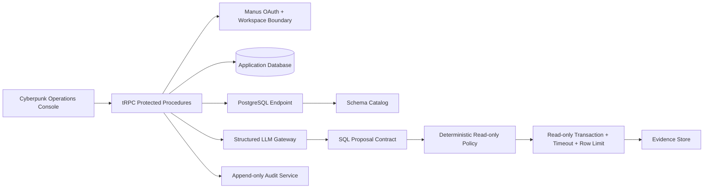

# DBOps AI Architecture

The frontend is a React operations console. The backend uses typed tRPC procedures, a Drizzle application schema, a PostgreSQL integration service, deterministic SQL policy modules, an encryption module, structured LLM contracts, and an append-only audit service. Each request is scoped to the authenticated user’s workspace before connection, schema, query, or audit records are read or written.

## Request lifecycle

| Stage | Component | Guarantee |
|---|---|---|
| Request | Assistant procedure | Authenticated workspace and connection boundary. |
| Context | Schema catalog | Relevant metadata only; no credential exposure. |
| Proposal | Structured LLM contract | JSON shape, confidence, assumptions, and clarification fields are required. |
| Verify | SQL policy engine | Read-only allowlist, known identifiers, single statement, normalized SQL. |
| Execute | PostgreSQL service | Read-only transaction, timeout, server-side row limit, normalized JSON rows. |
| Explain | Evidence explanation | Explanation is generated only from returned rows and execution metadata. |
| Audit | Append-only event service | Lifecycle event with actor, workspace, request, status, metadata, and timestamp. |

The current production boundary is intentionally read-only. Mutation routes are not exposed by the backend, and the user-facing UI states when a surface is awaiting evidence rather than inventing system findings.
